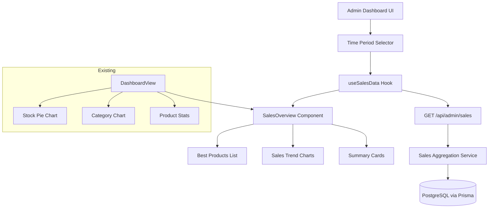

# Design Document: Admin Dashboard Overview

## Overview

This design adds a sales analytics overview section to the existing admin dashboard of the Sea Harvest Premium Seafoods application. The feature introduces a new API endpoint (`/api/admin/sales`) that aggregates order data by time period (daily, weekly, monthly) and computes best-performing products. The frontend renders this data as interactive charts and summary cards within the existing `DashboardView` component, using the recharts library already in the project.

The design leverages the existing Prisma ORM, Next.js API routes, and the project's established patterns for admin authentication, rate limiting, and response formatting.

## Architecture



**Key architectural decisions:**

1. **Single API endpoint** — A single `/api/admin/sales` route handles both sales aggregation and best-performing products in one request. This reduces HTTP round-trips and ensures the UI updates atomically when the period changes.

2. **Server-side aggregation** — All grouping and ranking logic lives in the API route using Prisma raw queries (for efficient GROUP BY operations). The frontend receives pre-computed data.

3. **Custom hook for data fetching** — A `useSalesData` hook encapsulates fetching, caching, loading/error states, and request cancellation via AbortController.

4. **Pure computation functions** — The aggregation logic (grouping orders by period, computing rankings) is extracted into pure utility functions that receive order data and return computed results. This enables property-based testing without database dependencies.

## Components and Interfaces

### API Layer

#### `GET /api/admin/sales`

**Query Parameters:**
| Parameter | Type | Required | Default | Description |
|-----------|------|----------|---------|-------------|
| period | string | Yes | — | One of "daily", "weekly", "monthly" |
| startDate | string (YYYY-MM-DD) | No | Period-dependent | Start of date range |
| endDate | string (YYYY-MM-DD) | No | Today | End of date range |

**Response Shape:**
```typescript
interface SalesResponse {
  summary: {
    totalOrders: number
    totalRevenue: number
    averageOrderValue: number
    uniqueProductsSold: number
  }
  timeSeries: Array<{
    period: string        // "2024-01-15" | "2024-W03" | "2024-01"
    orderCount: number
    revenue: number
  }>
  bestProducts: Array<{
    productName: string
    totalQuantity: number
    totalRevenue: number
    orderCount: number   // distinct orders containing this product
  }>
}
```

**Error Responses:**
- `400` — Invalid period parameter or malformed date range
- `401` — Missing or invalid admin secret
- `429` — Rate limited

### Utility Functions (Pure, testable)

```typescript
// src/lib/sales-aggregator.ts

interface OrderData {
  id: string
  status: string
  totalAmount: number | null
  createdAt: Date
  items: Array<{
    productId: string
    productName: string
    price: number
    quantity: number
  }>
}

type Period = 'daily' | 'weekly' | 'monthly'

interface AggregationEntry {
  period: string
  orderCount: number
  revenue: number
}

interface ProductPerformance {
  productName: string
  totalQuantity: number
  totalRevenue: number
  orderCount: number
}

interface SummaryStats {
  totalOrders: number
  totalRevenue: number
  averageOrderValue: number
  uniqueProductsSold: number
}

// Pure functions
function filterQualifyingOrders(orders: OrderData[]): OrderData[]
function aggregateByPeriod(orders: OrderData[], period: Period): AggregationEntry[]
function computeBestProducts(orders: OrderData[], limit?: number): ProductPerformance[]
function computeSummaryStats(orders: OrderData[]): SummaryStats
function getDefaultDateRange(period: Period): { startDate: Date; endDate: Date }
function validateDateRange(startDate: string, endDate: string): { valid: boolean; error?: string }
function validatePeriod(period: string): period is Period
function getPeriodLabel(date: Date, period: Period): string
```

### Frontend Components

```typescript
// src/app/admin/components/SalesOverview.tsx

interface SalesOverviewProps {
  // No props needed — self-contained with internal state
}

// Internal sub-components:
// - TimePeriodSelector: Tab-style selector for Day/Week/Month
// - SummaryCards: Grid of 4 metric cards
// - SalesTrendCharts: Bar chart (orders) + Line chart (revenue)
// - BestProductsList: Ranked list + horizontal bar chart
```

### Custom Hook

```typescript
// src/hooks/useSalesData.ts

interface UseSalesDataReturn {
  data: SalesResponse | null
  loading: boolean
  error: string | null
  period: Period
  setPeriod: (p: Period) => void
  retry: () => void
}

function useSalesData(): UseSalesDataReturn
```

## Data Models

No new database models are required. The feature queries existing models:

- **Order** — filtered by `status` (CONFIRMED, PROCESSING, DELIVERED) and `createdAt` within date range
- **OrderItem** — joined via `orderId` for product performance calculations

### Query Strategy

For the aggregation queries, the implementation uses Prisma's `groupBy` and `aggregate` methods rather than raw SQL, maintaining consistency with the existing codebase (`/api/admin/stats/route.ts`):

```typescript
// Orders grouped by period (example for monthly)
db.order.groupBy({
  by: ['createdAt'],  // Post-processed in JS for period grouping
  where: {
    status: { in: ['CONFIRMED', 'PROCESSING', 'DELIVERED'] },
    createdAt: { gte: startDate, lte: endDate }
  },
})

// Best products via OrderItem aggregation
db.orderItem.groupBy({
  by: ['productName'],
  where: {
    order: {
      status: { in: ['CONFIRMED', 'PROCESSING', 'DELIVERED'] },
      createdAt: { gte: startDate, lte: endDate }
    }
  },
  _sum: { quantity: true },
  orderBy: { _sum: { quantity: 'desc' } },
  take: 10,
})
```

**Note:** Since Prisma's `groupBy` doesn't support arbitrary date truncation (DAY/WEEK/MONTH), orders are fetched with a WHERE clause on the date range, then grouped in-memory using the pure `aggregateByPeriod` function. This keeps the logic testable and avoids database-specific SQL.

## Correctness Properties

*A property is a characteristic or behavior that should hold true across all valid executions of a system — essentially, a formal statement about what the system should do. Properties serve as the bridge between human-readable specifications and machine-verifiable correctness guarantees.*

### Property 1: Aggregation grouping preserves order count

*For any* set of qualifying orders and any valid period (daily, weekly, or monthly), the sum of `orderCount` across all returned aggregation entries SHALL equal the total number of qualifying orders within the date range.

**Validates: Requirements 1.1, 1.2, 1.3**

### Property 2: Status filtering excludes non-qualifying orders

*For any* set of orders with mixed statuses, the aggregation and product performance computations SHALL include only orders with status CONFIRMED, PROCESSING, or DELIVERED, and the total count across all aggregation buckets SHALL equal the count of orders matching those statuses within the date range.

**Validates: Requirements 1.4, 2.2**

### Property 3: Aggregation entries contain required fields

*For any* non-empty set of qualifying orders and any valid period, every returned aggregation entry SHALL contain a non-empty period label string, a non-negative orderCount, and a non-negative revenue value where revenue equals the sum of totalAmount for orders in that bucket.

**Validates: Requirements 1.5**

### Property 4: Invalid period parameter produces error

*For any* string that is not one of "daily", "weekly", or "monthly", the period validation function SHALL return false (invalid), ensuring the API rejects the request.

**Validates: Requirements 1.8, 2.9**

### Property 5: Invalid date range produces error

*For any* date pair where start date is after end date, or where the span exceeds 365 days, the date range validation function SHALL return an error indication.

**Validates: Requirements 1.9, 1.10**

### Property 6: Best products ranking correctness

*For any* set of qualifying orders with order items, the best-performing products list SHALL be sorted in descending order by total quantity, with total revenue as a tiebreaker for equal quantities, and SHALL contain at most 10 entries.

**Validates: Requirements 2.1, 2.8**

### Property 7: Product performance entry completeness

*For any* product appearing in the best-performing list, its `totalQuantity` SHALL equal the sum of quantities from all qualifying order items for that product, its `totalRevenue` SHALL equal the sum of (price × quantity) from those items, and its `orderCount` SHALL equal the number of distinct orders containing that product.

**Validates: Requirements 2.3**

### Property 8: Summary statistics consistency

*For any* set of orders within a date range, the summary `totalOrders` SHALL equal the count of qualifying orders, `totalRevenue` SHALL equal the sum of their totalAmount values, and `averageOrderValue` SHALL equal totalRevenue divided by totalOrders (or zero if totalOrders is zero).

**Validates: Requirements 6.1, 6.2, 6.3**

### Property 9: Unique products count accuracy

*For any* set of qualifying orders with order items, the `uniqueProductsSold` count SHALL equal the number of distinct `productId` values across all order items from qualifying orders within the date range.

**Validates: Requirements 6.4**

## Error Handling

| Scenario | Handling |
|----------|----------|
| Invalid period parameter | Return 400 with descriptive error message |
| Malformed date range (non-ISO format) | Return 400 with "Invalid date range" message |
| Start date after end date | Return 400 with "Start date must be before end date" |
| Date range exceeds 365 days | Return 400 with "Date range cannot exceed 365 days" |
| Missing admin secret | Return 401 Unauthorized |
| Database query failure | Return 500, log error server-side, frontend shows retry |
| Rate limit exceeded | Return 429 with Retry-After header |
| Network failure (frontend) | Display error message with retry button, don't disrupt other dashboard sections |
| Request cancelled (period change) | Silently abort via AbortController, no error shown |
| No data for selected period | Display empty state message, show zeros in summary cards |

The frontend uses React error boundaries scoped to the `SalesOverview` component to prevent errors from cascading to the existing dashboard sections.

## Testing Strategy

### Unit Tests (Example-based)

- API route: test parameter validation, auth checks, error responses
- Component: test loading/error/empty states, period selector interaction
- Default date range calculations for each period
- Time period boundaries (current day/week/month for best products)

### Property-Based Tests

**Library:** vitest with `fast-check` (to be added as dev dependency)

**Configuration:**
- Minimum 100 iterations per property test
- Each test tagged with: `Feature: admin-dashboard-overview, Property {N}: {title}`

**Properties to implement:**
1. Aggregation grouping preserves order count
2. Status filtering excludes non-qualifying orders
3. Aggregation entries contain required fields
4. Invalid period parameter produces error
5. Invalid date range produces error
6. Best products ranking correctness
7. Product performance entry completeness
8. Summary statistics consistency
9. Unique products count accuracy

**Generators needed:**
- `arbOrder`: generates Order objects with random status, totalAmount, createdAt, and items
- `arbOrderItem`: generates OrderItem objects with random productId, productName, price, quantity
- `arbPeriod`: generates one of "daily" | "weekly" | "monthly"
- `arbInvalidPeriod`: generates strings not in the valid period set
- `arbDateRange`: generates valid ISO date pairs within 365-day span
- `arbInvalidDateRange`: generates date pairs where start > end or span > 365

### Integration Tests

- End-to-end API test with seeded database verifying full response shape
- Component integration test verifying data flow from API to charts

### What's NOT property-tested

- UI rendering (charts, styling, animations) — use component snapshot/example tests
- Request cancellation logic — example-based unit test with mocked AbortController
- Responsive layout — manual testing / visual regression
- Performance (3-second response time) — monitoring, not automated tests
